# Hey, I'm Ajit 👋

<picture>
  <source media="(prefers-color-scheme: dark)" srcset="./dark.svg">
  <source media="(prefers-color-scheme: light)" srcset="./light.svg">
  
</picture>

  <b>AI / ML Engineering · LLM Agents & RAG · Applied Data Science · Full-Stack Development</b>

  🐍 Python &nbsp;·&nbsp; 🔥 PyTorch &nbsp;·&nbsp; 🦜 LangChain &nbsp;·&nbsp; 📊 scikit-learn / LightGBM
  &nbsp;·&nbsp; 🗄️ SQL &nbsp;·&nbsp; ⚛️ React / Node.js &nbsp;·&nbsp; 🐳 Docker / AWS

I'm a B.Tech undergraduate (Electrical & Electronics Engineering) at **BIT Mesra**. I build **LLM agents, RAG pipelines, machine-learning systems and data analytics projects**, and ship them as working applications.

---

## 🤖 What I Build

- 🧠 **LLM agents & RAG**: retrieval pipelines, agentic workflows and tool integrations
- 🔬 **Deep learning**: speech synthesis, CNNs and RNNs in PyTorch
- 📈 **Applied ML**: entity resolution, risk scoring and prediction models on tabular data
- 📊 **Data & business analytics**: SQL, causal inference, dashboards in Power BI and Excel
- ⚛️ **Full-stack applications**: React, Node.js, Express, MongoDB, FastAPI and Flask
- ☁️ **Deployment**: Docker and AWS EC2

---

## 💼 Experience

### AI Research Intern · Jio Institute
**Jun 2026 – Jul 2026 · Navi Mumbai**

Worked under the Chief Data Scientist on the FORGE and Education Ontology projects.

- Built a forward reasoning engine for automated Physics problem solving using symbolic AI and multi-step logical inference, with fully traceable derivations
- Designed an Education Ontology mapping Indian youth value systems to career choices, for use by policy makers

### AI Engineer Intern · Eko Bharat Pvt. Ltd.
**May 2026 · Gurugram**

- Built an end-to-end automated report generation pipeline for the Sales team, producing per-CSP reports from raw data sources
- Worked with the DevOps team to design an AI-powered ticketing automation system integrated with the internal database

### Research Head · Society of Industrial Engineering and Management, BIT Mesra
**Apr 2024 – Present**

- Lead research initiatives and curate technical content for the society's publications, events and knowledge-sharing sessions

---

## 🎓 Education

**B.Tech, Electrical & Electronics Engineering** · Birla Institute of Technology, Mesra · 2023 – 2027

- G.P. Birla Scholarship for Academic Excellence, two consecutive academic years

---

## 🧩 Featured Projects

### 🗣️ Tacotron2-TTS · Neural Text-to-Speech
[Repository](https://github.com/stack-ajit/Tacotron2-TTS)

- End-to-end speech synthesis in PyTorch on the Tacotron 2 architecture: encoder, location-sensitive attention and Post-Net, with a Griffin-Lim vocoder
- Data pipeline for LJSpeech-1.1 (13,100 samples): text tokenisation and Mel spectrograms
- **PyTorch · Librosa · Torchaudio**

### 🎬 YouTube RAG Q&A Engine
[Repository](https://github.com/stack-ajit/youtube-video-RAG-QnA)

- Local-first RAG pipeline over YouTube transcripts: Whisper transcription, sentence-transformer embeddings and a persisted ChromaDB vector store
- FastAPI application with async background ingestion and a Groq-hosted LLM for grounded answers
- **LangChain · Whisper · ChromaDB · Groq · FastAPI**

### 🔗 Business Entity Resolution · Amazon ML Challenge 2026
[Repository](https://github.com/stack-ajit/business_entity_resolution)

- ML pipeline that matches and deduplicates noisy business records across sources with no shared identifiers
- Hashed TF-IDF blocking, then a three-stage LightGBM pruner, matcher and context model with one-to-one resolution; CPU only
- **Python · LightGBM · scikit-learn**

### 🤖 OpenClaw · Autonomous LLM Agent Deployment
[Repository](https://github.com/stack-ajit/openclaw-agents/tree/main/openclaw-agents)

- Agentic workflows with Gmail, Drive, Docs, Sheets and Contacts as agent-accessible tools
- Deployed on AWS EC2 with Docker; connected Tavily, a Telegram bot and the WhatsApp Cloud API
- **n8n · AWS EC2 · Docker · Google Workspace APIs**

### 🧭 ZipTara · Travel Itinerary Platform
[ziptara.in](https://www.ziptara.in/)

- Full-stack platform for multi-day trip planning with Google Maps geocoding and interactive routes
- JWT and Google OAuth 2.0 authentication with role-based route protection; Cloudinary media storage
- **React · Node.js · Express · MongoDB · Google Maps API**

### 💳 AI Risk Manager
[Repository](https://github.com/stack-ajit/AI_risk_manager)

- ML chargeback risk detector and evidence responder that scores authorisations in real time and optimises on rupee cost rather than accuracy
- **Python**

### 📊 More data & analytics work

| Project | What it is |
|---|---|
| [pharma-causal-optimization](https://github.com/stack-ajit/pharma-causal-optimization) | DuckDB + propensity score matching to remove targeting bias from a marketing budget analysis |
| [rag-pipeline-from-scratch](https://github.com/stack-ajit/rag-pipeline-from-scratch) | RAG built step by step: ingestion, chunking, embedding, retrieval, grounded generation |
| [solar-energy-business-analytics](https://github.com/stack-ajit/solar-energy-business-analytics) | SQL analysis, churn and credit-risk models for a Pay-As-You-Go solar business |
| [sql-data-warehouse-project](https://github.com/stack-ajit/sql-data-warehouse-project) | Data warehouse on SQL Server with ETL, data modelling and analytics |
| [Order-Cancellation-Driver-Analysis](https://github.com/stack-ajit/Order-Cancellation-Driver-Analysis) | Case study on the drivers of order cancellations in an e-commerce marketplace |

---

## 🛠️ Engineering Stack

### 🤖 AI / Machine Learning
`Python` `PyTorch` `LangChain` `RAG` `ChromaDB` `scikit-learn` `LightGBM` `Pandas` `NumPy`

### ⚛️ Web & Backend
`React.js` `Node.js` `Express.js` `FastAPI` `Flask` `REST APIs` `MongoDB` `Tailwind CSS`

### 🗄️ Languages & Data
`Python` `C++` `JavaScript` `SQL (MySQL)` `DuckDB` `Power BI` `Excel`

### ☁️ Cloud / DevOps
`AWS EC2` `Docker` `Kubernetes` `Terraform` `Linux` `Git` `GitHub Actions` `Prometheus` `Grafana`

---

## 📊 GitHub Activity

  

  <picture>
    <source media="(prefers-color-scheme: dark)" srcset="https://raw.githubusercontent.com/stack-ajit/stack-ajit/output/github-snake-dark.svg">
    <source media="(prefers-color-scheme: light)" srcset="https://raw.githubusercontent.com/stack-ajit/stack-ajit/output/github-snake.svg">
    <!--  -->
  </picture>

---

## 📫 Connect With Me

  💼 <a href="https://www.linkedin.com/in/ajit-kumar-5628902b0/">LinkedIn</a> 
  🌐 <a href="https://ajit-kumar-02.vercel.app/">Portfolio</a> 
  📧 <a href="mailto:stack.ajit@gmail.com">Email</a>

> **Learn it. Build it. Ship it.**
